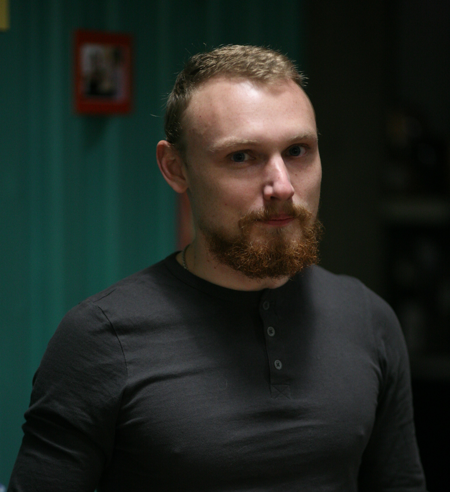
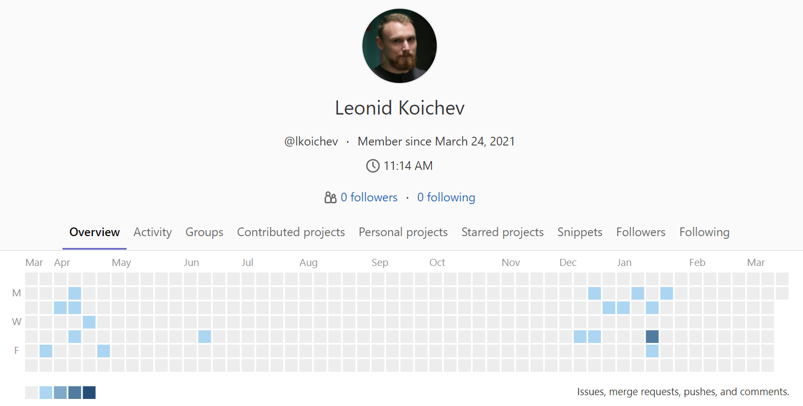
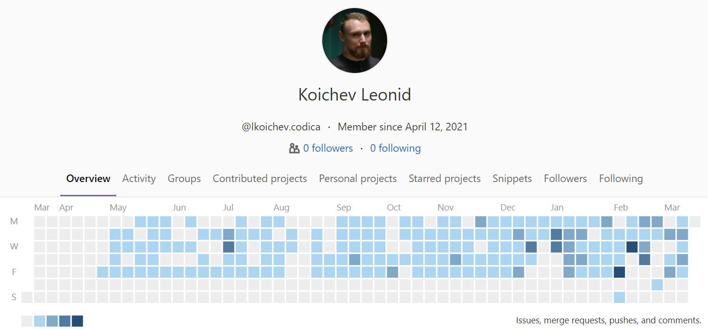

# Koichev Leonid
 

### Front-end developer (Vue.js)
---

### Contact information:

- **Phone:** [+38(098)350-43-45](tel:+380983504345)
- **Email:** [liones3000@gmail.com](mailto:liones3000@gmail.com)

  
### Skills
---

 - Vue.js v.3 (v.2), Vuex | Pinia, Vue Router, TypeScript, Git, Oh My Zsh
 - JavaScript ES12 (including updates until 2022), jQuery
 - npm, Yarn
 - Gulp, Webpack, Bower
 - HTML5 (including updates until 2022) 
 - CSS3 (including updates until 2022), SCSS
 - BEM, Atomic CSS, MCSS
 - Bootstrap, Vuetify, Element
 - Figma, Photoshop, Avocode
 - Trello, Jira
 - I work with any API
  
### Project activity
---

#### GitLab

1.  

2.  
 

#### Codewars

 

### Employment History
---

- March 2020 - now. I work for **Codica** as a Vue.js developer. `Use: JS, SCSS, Vue.js 2, Vuex, Vue Router, Vue CLI, Webpack, Vuetify, Bootstrap, yarn, and other libraries`.
  

Details

  <i>For more than a year I have been a project leader. I communicate directly with clients on all issues (mostly correspondence). I am engaged in training new employees with further implementation in the project.</i>
  

- February 2019 - March 2020. Worked as a front-end developer at **Aimix-Kharkov**. `Use: JS, LESS, Vue.js 2, Vuex, Vue Router, Webpack, Iconmoon`
  

Details

  <i>Development of landing pages, online stores (for example, kratomhelper.com), and SPA applications.</i>
  

- June 2018 - February 2019. Worked freelance. Executed various orders for the layout of landing pages, written on js. `Use: HTML, SCSS, JS, Gulp, Webpack, npm, Git`.
  

Details

  <i>Improved practical skills in website layout, project assembly, and deployment.</i>
  

- February 2012 – August 2019. System administrator, web developer at **Your-Baby** and **Your-Family** (Medicine and Healthcare). `Use: Drupal 7, HTML, CSS, JS`.
  

Details

    
<i>Thanks to my efforts to automate the registration and service process, as well as a user-friendly website, the clinic received a huge  influx of clients. As a result, there is a streamlined workflow and clinics have opened in 3 cities of Ukraine.</i>

  

> Recommendations: I am ready to provide upon request.

### Education
---

- 2020 - Completed courses from "EasyCode" in the specialty «Front-end + Vue». 
  - Updated my knowledge HTML5, CSS3, JS ES6+, Flexbox, CSS Grid Layout, Git.
  - Got new knowledge on: ES8, Vue+Vuex, SCSS, npm, BEM methodology. I use Gulp, Webpack, Bootstrap, Materialize, Element io, jQuery. 
- 2017 - Completed courses from «A-Level» in the specialty «Front-end basic». Got knowledge HTML5, CSS3, JavaScript ES6, jQuery, Flexbox.
- 2012 - Completed courses from «PCnit» in the specialty «PHP Web Programming». Got knowledge in PHP and MySQL.
- 2005 - 2010. Entered in *Kharkiv National University of Civil Engineering and Architecture (KNUCEA)* to the faculty *«Economic cybernetics»*. Completed the master's degree, received a master's degree with qualification **«Economist-mathematician (cyberneticist)»**.
- 2005 - Finished school. Received a certificate of complete secondary education.

### Language proficiency
---

- English - Pre-Intermediate (studying at the moment)
- Ukrainian is my native language
- Russian - I speak fluently
